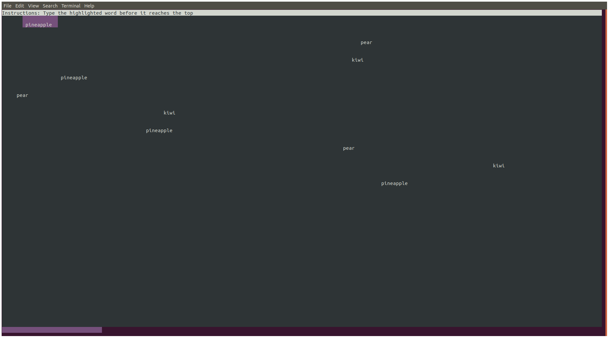

# ⌨️ Mistype.js

[](https://opensource.org/licenses/MIT)

A terminal-based typing game written in JavaScript



### Install and play

```bash
git clone https://github.com/pabrodez/mistype
cd mistype
npm install && npm run play
```

You can store a text file with comma separated words (no spaces) in the wordLists folder and use the list of words in the next round. Just pass an argument with the name after the ```--```

```bash
npm run play -- yourlistofwords.txt
```
